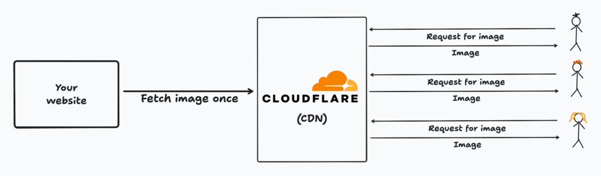
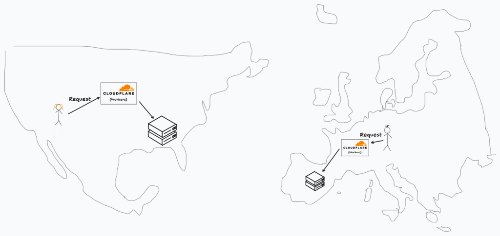

You probably know about Cloudflare for their DDoS protection and Content Delivery Network (CDN). But in recent years, they have started to move into the general cloud computing space. At the center of it all are Cloudflare Workers.

* * *

In theory, you can host your whole backend on Workers. In practice, this isn’t really common because the compute resources are constrained, for example, each isolate has a memory limit of 128MB. Instead of thinking about Workers as a regular compute offering like a virtual machine, I would recommend thinking about them as the next iteration of a CDN.

But now instead of mere assets (like images) being cached by Cloudflare, we can ourselves define code that should be run when a request by a user arrives. Basically, you can program your own CDN with your own code! The advantage: all of this code is run in the same Cloudflare infrastructure on the _edge_.

Now, we can do really cool stuff. Imagine for example you have two servers: one in Europe and one in the US. If a user makes a request from Europe, this will be handled by a Cloudflare server located in Europe, if they are in the US, a US Cloudflare server. If we define a worker, we can run our own code for those requests! For example, routing them to our respective Europe/US servers

_Note: This post is still being updated, right now I am trying out [agents.cloudflare.com](https://agents.cloudflare.com "agents.cloudflare.com") and I plan to also talk about the AI angle of Cloudflare workers!_

1.  Sorry, I forgot a lot of islands, and Canada. And no, the USA and Europe are much further away. [↩︎](#30090c0a-99f4-4174-a1ad-ea12656aca25-link)
