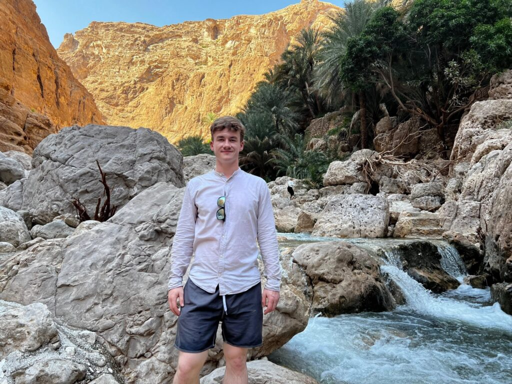
*Me in the Wadi Shab*

## Notes

After finishing my Bachelors at ETH Zurich, I spent four months (September 2024 to January 2025) at the German University of Technology working as a teaching assistant.

The main goal of me and my girlfriend (who also went to Oman) was to get to know a completely different country.

Therefore, we used every occasion to travel as much as possible and spent time with friends getting to know a different culture.

## Our Travels

Oman is a huge country that you can mostly travel by yourself via the well-maintained road and highway network. But because there is effectively no public transport, you will definitely need to rent a car!

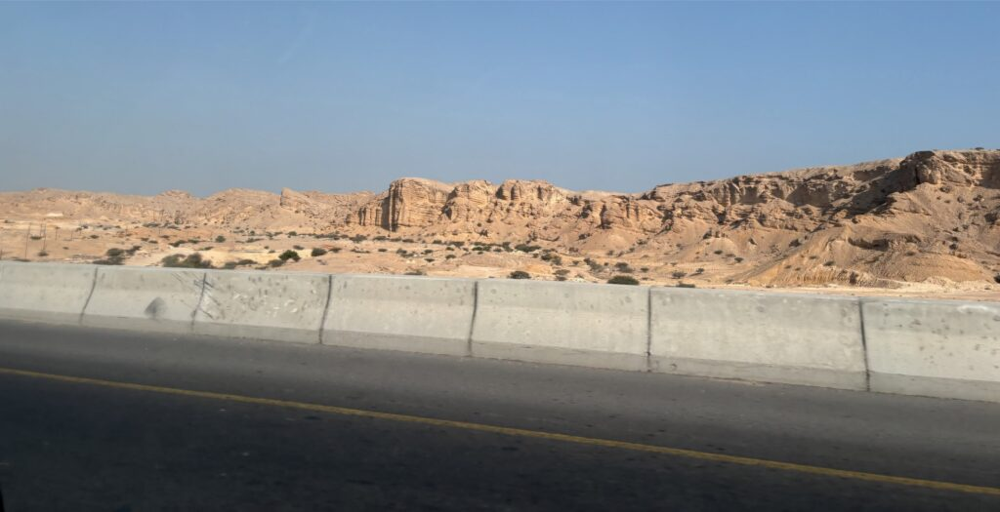
*Typical landscape when traveling on the highway*

Oman has a beautiful geology, nature and beautiful cities one should visit.

_Wadis_ (Arabic word for river valleys) have beautiful greenery which is very rare in the rest of the desert country. The most famous and widely visited wadi is called _Wadi Shab_ (see picture in the beginning of this blogpost).

But there are also many others.

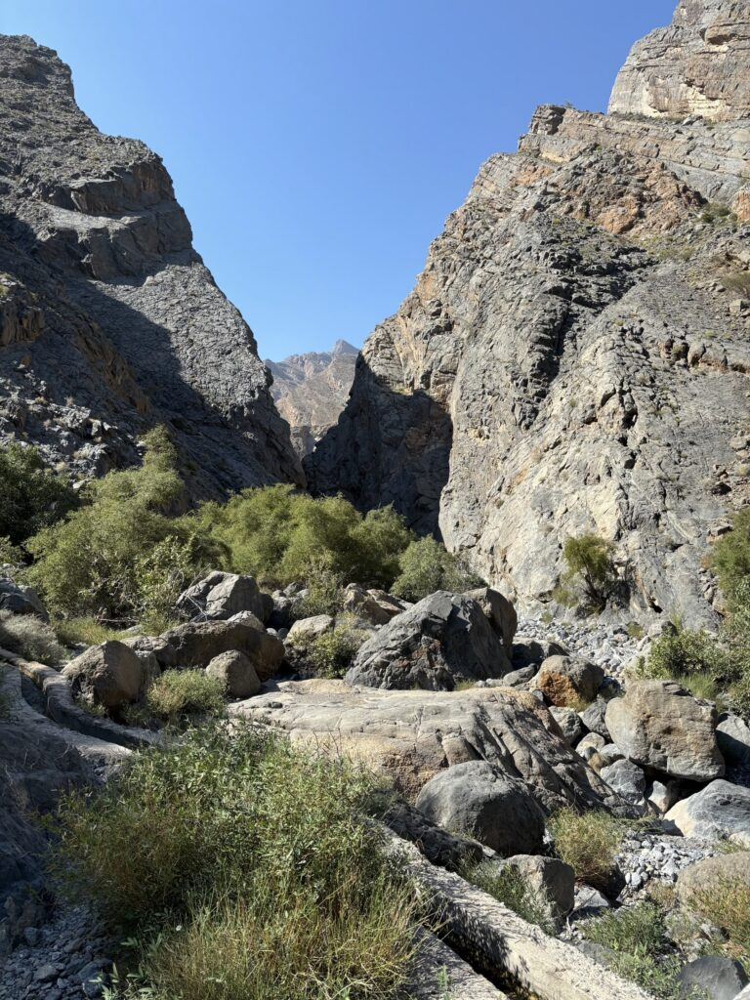
*Wadi Qurai is less frequented by tourists*

In many parts of Oman one can still find remainings of life before technology. In the old village of Ibra, we learned about have traditionally small villages were built.

There are also many forts throughout Oman, such as in Nizwa (the old capital, it also has a beautiful old city) or Bahla.

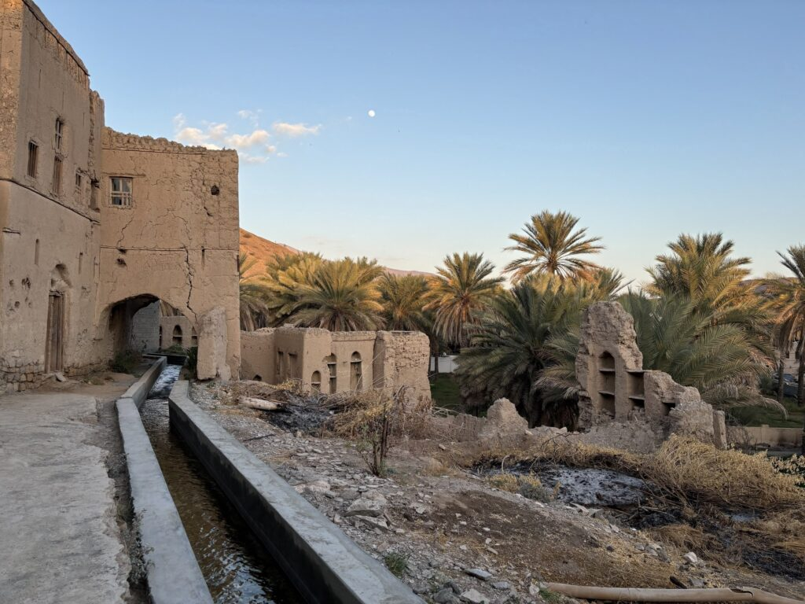
*Ruins in Birkat al Mouz, close to Nizwa*

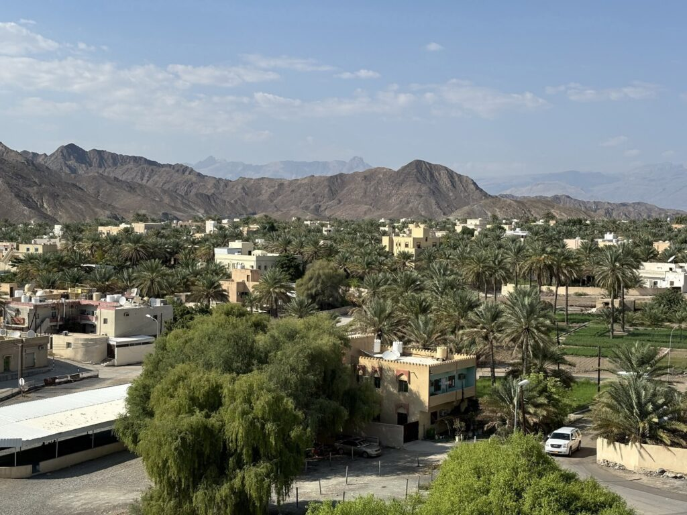
*View from Bahla Fort*

And of course, one should also see the desert!

While the majority of central Oman is considered desert, only small parts of it have the beautiful sand dunes. The most famous location for those is called _Wahiba sands_.

Together with multiple other cars and professional guides (this is recommended if you don’t want to die), we drove through the desert and camped on a dune.

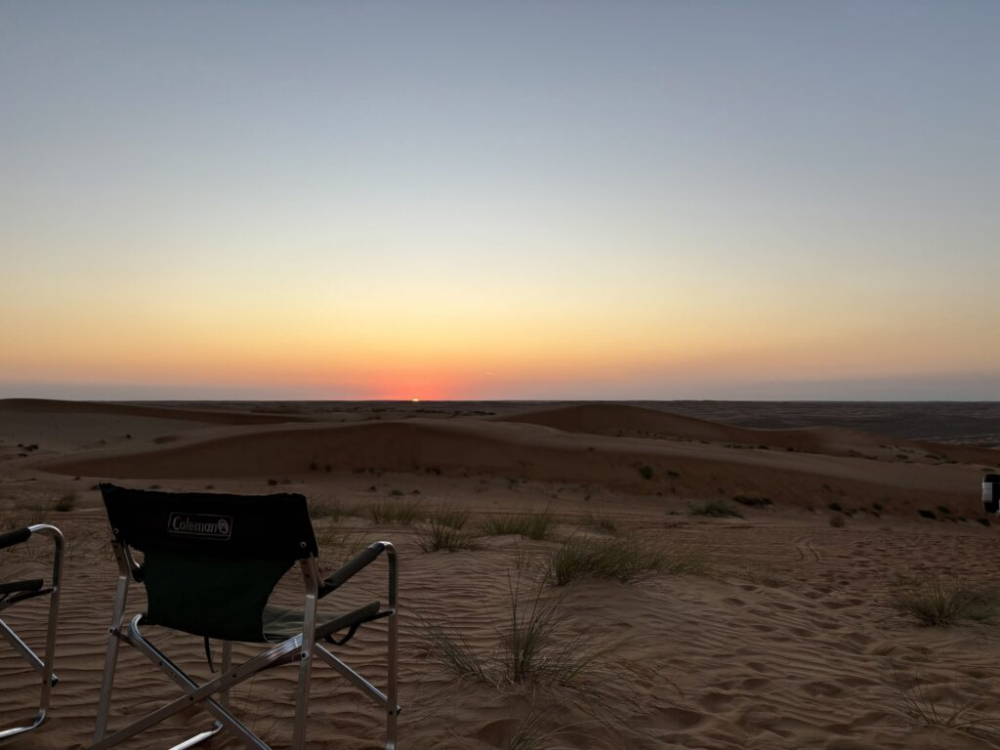
*Desert view in the morning*

On the second day, we continued west to beautiful sandy beaches.

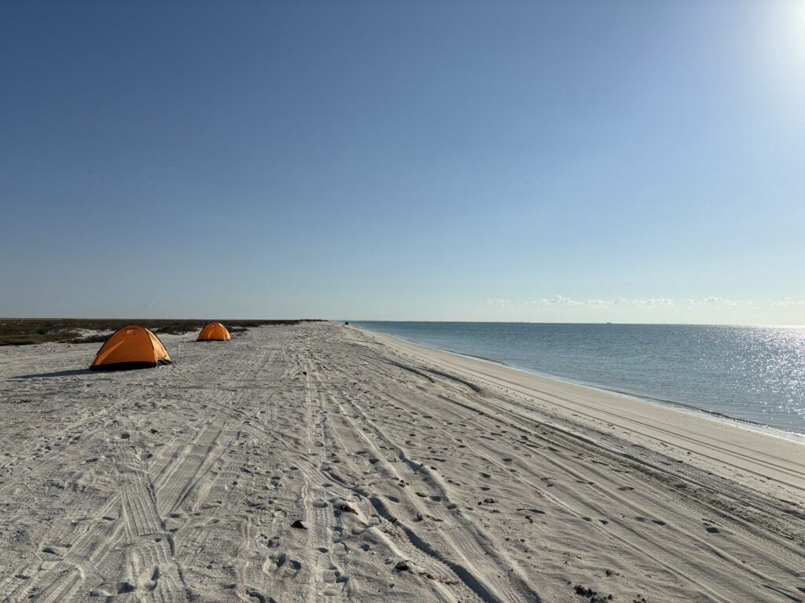
*Camping on a beach at the Gulf of Masira (western coast of Oman)*

Oman also has a few mountains, such _Jabal Shams_ and _Jabal Akhdar_. They are popular because of their cooler temperatures and hiking paths.  
Both are very beautiful, and we even camped on Jabal Shams (and it was freezing cold at night!). There, we were also invited for a fireside chat and tea by three Omanis – this is very indicative of the welcoming Omani culture.

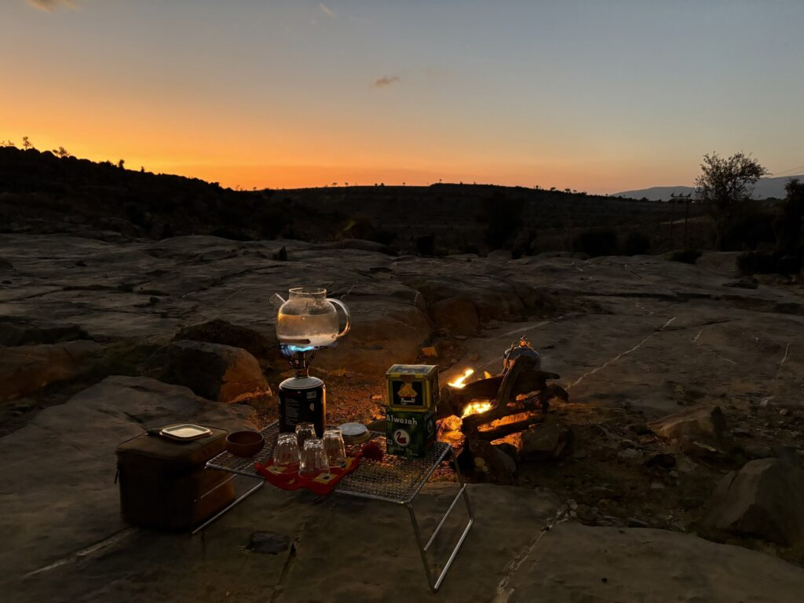
*Enjoying hot tea on the cold Jabal Shams*

## Culture and People

Before coming to Oman, I had never visited any Arab or even Muslim country.

Although many things in Oman are very different, we fortunately never had any true culture shock because our friends were always happy to answer any stupid questions, and Omanis are generally very accepting to Westerners not adhering to the Omani norms.

For example, when you google “Omani people” you will see the typical cloths of men and women: white dishdashas and black abayas. So as a westerner, you will always stick out. Still you should wear modest clothing – covering knees and shoulders (in general I always wore long pants, and most of the time long-sleeved shirts). But if you would wear something like shorts, no Omani would ever come up to you and comment on it – but more conservative people would definitely find it not ideal.

We also noticed other big differences.

Casual dating in the western understanding is basically non-existent. Young people from conservative households basically have to marry first. And even in less strict families, young people restrict their dating to meeting and strolling on campus, sometimes going to public places like cinemas, or coffee places – but never to each others home.

## Would I do it again?

I really enjoyed the four months in Oman. Traveling and getting to know the country and people was a great experience. I must note however, that I was really lucky with the Computer Science department at the university – the colleagues and professors were really great! Friends from other departments however, often had more stressful environments.

Therefore, if you are a CS student and think about doing the same internship – do it!

## Gallery

Next, some more photos I want to show you (but didn’t manage to include in the post).

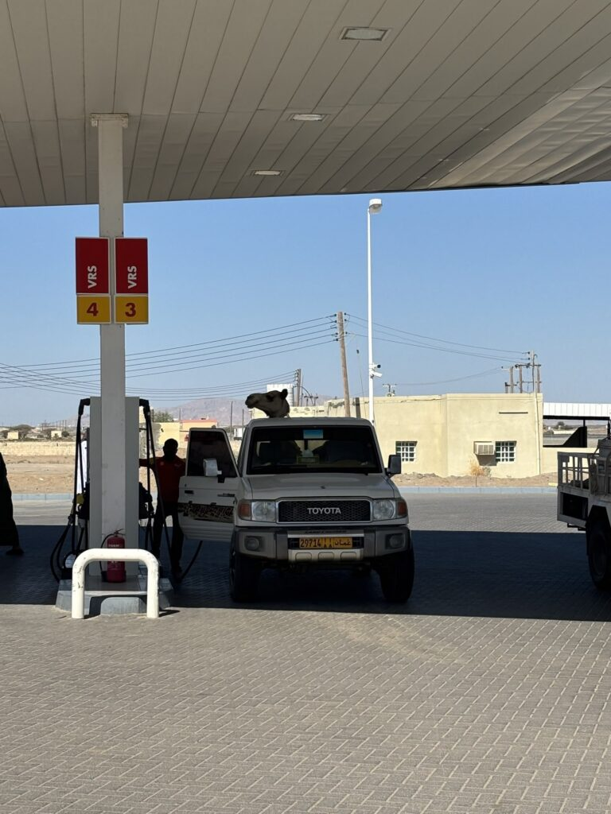
*Just a camel on pickup truck*

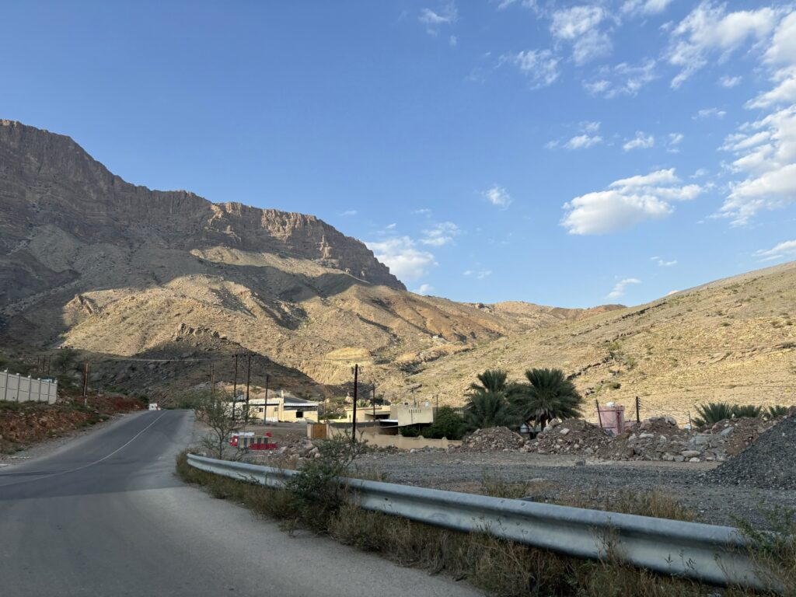
*Jabal Shams (one of the mountains in Oman)*

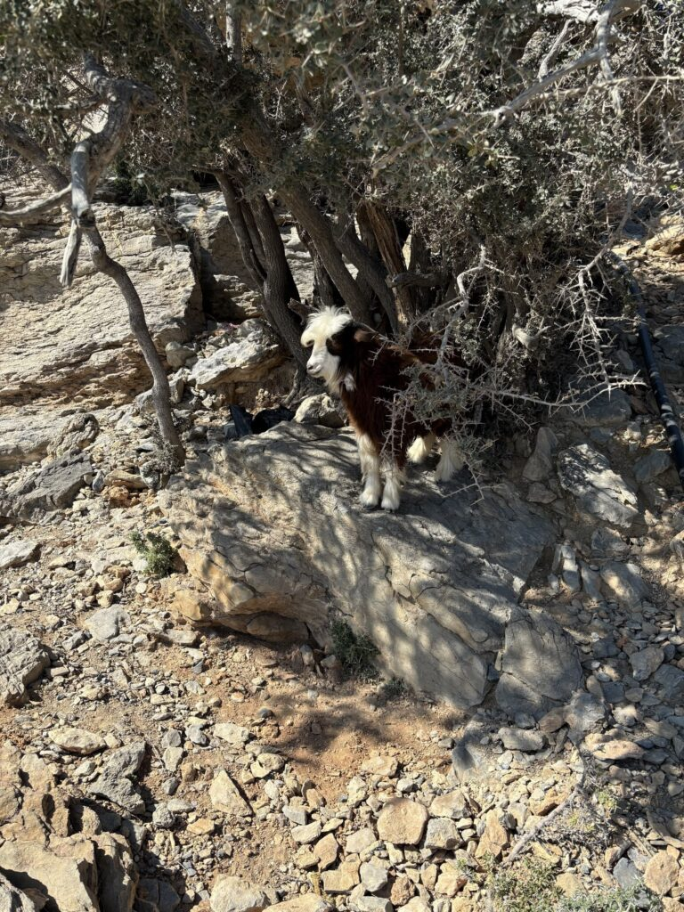
*You often see cute, wild goats in the mountains*

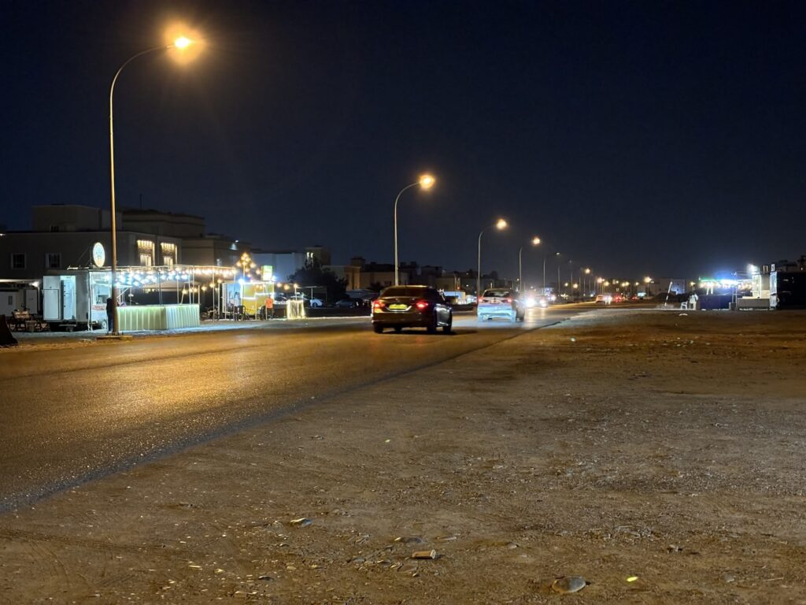
*Typical inner city street with street food vendors*

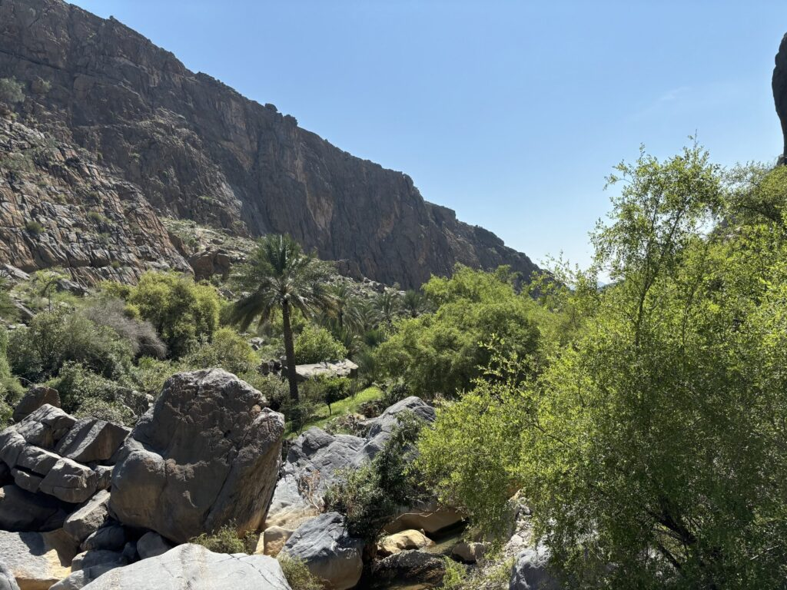
*Wadi next to the historic village ‘Misfat al Abrayeen’*
